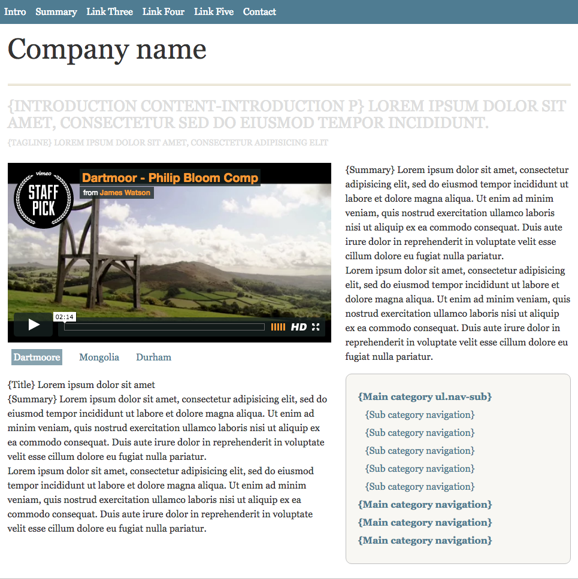
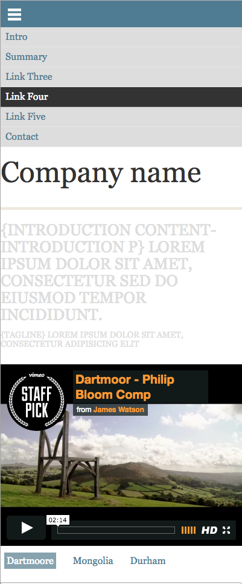

# Foundations Session 7 

Install [Visual Studio Code](https://code.visualstudio.com) now.

## Homework

1. Review the process used to set up this project and add JavaScript for the video player
1. Updload your results to Github and send me a link





Examine the structure of `index.html` in the app folder. Note that it uses `base.css`. Also note the use of page fragment links - e.g.:

```html
<li><a href="#videos">Videos</a></li>
```

## Header

Note that `base.css` uses an @import to import `reset.css`. Reset is a [normalization](https://github.com/sindresorhus/modern-normalize) set of css rules. It ensures proper rendering across browsers.

Add `header.css` with the following content and use `@import` to include it in base.css:

```css
header {
	max-width: 940px;
}
header h1 {
	font-size: 3rem;
	margin: 0;
}
header p {
	font-size: 1.5rem;
	text-transform: uppercase;
	line-height: 1.1;
	margin-bottom: 1rem;
}
header h1 + p {
	padding-top: 1rem;
	border-top: 3px double #dbd1b5;
}
header p + p {
	font-size: 1rem;
	line-height: 1.1;
	color: #666;
}
```

## Demo - Using NPM for SASS

```sh
$ cd <sessionX>
$ npm init -y
$ npm install browser-sync node-sass concurrently --save-dev
```

Add the scripts to your package.json:

```sh
  "scripts": {
    "sassy": "node-sass --watch scss --output app/css --source-map true",
    "start": "browser-sync start --server 'app' --files 'app'",
    "boom!": "concurrently 'npm run start' 'npm run sassy' "
  },
```

```sh
  "scripts": {
    "sassy": "node-sass --watch \"scss\" --output \"app/css\" --source-map true",
    "start": "browser-sync start --server \"app\" --files \"app\"",
    "boom!": "concurrently \"npm run start\" \"npm run sassy\" "
  },
```

And run `$ npm run boom!`

### Set up and nesting

Create an imports folder in `scss`.

Move reset.css, base.css and header.css to the `scss/imports` folder and rename them `_reset.scss`, `_base.scss` and `_header.scss`. Delete the original `/css` files/

* Note the underscores as well as the `.scss` extensions.

Remove the @import statements `base.css`. 

* Always check for errors by looking at the processes running in the terminal.

Create a new file, styles.scss, in `/scss` and import the partials. `styles.scss` should look like:

```css
@import 'imports/reset';
@import 'imports/base';
@import 'imports/header';
```

Restart the rendering process in the terminal

* use Control-c to quit the currently running script(s)
* use `npm run boom!` again to kick it off

Confirm that the styles for the header are being applied by checking the browser rendering.

## Using an App for SASS Preprocessing

[Syntactically Awesome Style Sheets](https://sass-lang.com) - takes sass files and converts (compiles) them into css. sass [adds features](http://sass-lang.com/guide) to css.

[Koala](http://koala-app.coms)
[Scout app](https://github.com/scout-app/scout-app/)

* Note - on OSX you may need to right click and choose open rather than double click in order to run these.

For Scout the setup includes creating and input folder for sass and an output folder for css.

## Using VSCode for SASS Processing

Most editors will offer the ability do preprocessing as well as browser refresh.

[Visual Studio Code](https://code.visualstudio.com) offers an array of plug-ins that we can use to perform the SASS preprocessing function. VS Code is remarkably flexible and offers a setting for almost anything you could wish for. See the Visual Studio Code [documentation](https://code.visualstudio.com/docs/getstarted/settings) for changing settings.

[Live Sass Compiler](https://marketplace.visualstudio.com/items?itemName=ritwickdey.live-sass) for VS Code.

Install Live SASS Compiler and set the _workspace settings_ as shown:

```js
{
    "liveSassCompile.settings.formats": [
        {
            "savePath": "app/css",
            "format": "expanded"
        }
    ],
    "liveSassCompile.settings.excludeList": [
        "**/node_modules/**",
        ".vscode/**",
        "**/other/**"
    ]
}
```

Note the `.vscode` directory that is created for per project settings.

See the full [documentation](https://github.com/ritwickdey/vscode-live-sass-compiler/blob/master/docs/settings.md) for settings.

Click the `Watch Sass` button at the bottom of the editor.

## Review GIT in VSCode

* Use the terminal in initialize a Git repo
* Add and commit
* Create a repo on Github
* Setup and push

## Nesting SASS

Since we are using SASS includes we can delete the base.css and reset.css files from the css directory.

Refactor the css in `_header.scss` file to use nesting.

```css
header {
	max-width: 940px;
	margin: 0 auto;
	h1 {
		font-size: 3rem;
		margin: 0;
	}
	p {
		font-size: 1.5rem;
		text-transform: uppercase;
		line-height: 1.1;
		margin-bottom: 1rem;
	}
	h1 + p {
		padding-top: 1rem;
		border-top: 3px double #dbd1b5;
	}
	p + p {
		font-size: 1rem;
		line-height: 1.1;
		color: #666;
	}
}
```

Compare the resulting css file with the source sass file. 
Inspect the header in the developer tools and note the *mapping*.

* maps the css line numbers to the scss line numbers
* note the line numbers in the element inspector

### Media Query - Mobile First

Add a media query to hide the header paragraphs on small screens.

Normally this would be written as:

```css
		@media (max-width: 480px){
			header p {
				display: none;
			}
		}
```

But because we are nesting we can simply write (in `_header.scss`):

```css
	p {
		...
		@media (max-width: 480px){
			display: none;
		}
	}
```

Examine the resulting css. 

Examine the mapping.

Note: this is *not* a mobile first design pattern. It uses `max-width` to add display attributes to small screens.

Change it to use a `min-width` mobile first design pattern:

```css
p {
	display: none;
	@media (min-width: 480px){
		display: block;
		font-size: 1.5rem;
		text-transform: uppercase;
		line-height: 1.1;
		margin-bottom: 1rem;
	}
}
```

### Variables

Create and add `_variables.scss` to imports with:

```
$break-sm: 480px;
$break-med: 768px;

$max-width: 940px;

$link: #4e7c92;
$hover: #df3030;
$text: #333;

$med-gray: #666;
$light-gray: #ddd;
$dk-yellow: #dbd1b5;
```

Import it into `styles.scss`. Be sure to import it first in order to make the variables available to the subsequent imports.

Apply the color and break point variables to `_header.scss`. There are four such instances:

```css
header {
	max-width: $max-width;
	margin: 0 auto;
	h1 {
		font-size: 3rem;
		margin: 0;
	}
	p {
		display: none;
		@media (min-width: $break-sm){
			display: block;
			font-size: 1.5rem;
			text-transform: uppercase;
			line-height: 1.1;
			margin-bottom: 1rem;
		}
	}
	h1 + p {
		padding-top: 1rem;
		border-top: 3px double $dk-yellow;
	}
	p + p {
		font-size: 1rem;
		line-height: 1.1;
		color: $med-gray;
	}
}
```

## Responsive Main Nav

Note the link `<a href="#" id="pull"></a>` in the nav. We will use this to show a menu on small screens:

```html
  <nav>
    <a href="#" id="pull"></a>
    <ul>
      <li><a href="#">Home</a></li>
      <li><a href="#videos">Videos</a></li>
      <li><a href="#images">Images</a></li>
      <li><a href="#blog">Blog</a></li>
      <li><a href="#contact">Contact</a></li>
    </ul>
  </nav>
```

Create a sass partial `_navigation.scss` and import it into `styles.css` with `@import 'imports/navigation';`.

Small screen - hide the navigation

```css
nav {
	ul {
		display: none;
	}
}
```

Show and format the hamburger menu:

```css
nav {
	🔥
	#pull {
		display: block;
		background-color: $link;
		height: 32px;
		padding-top: 12px;
		padding-left: 12px;
	}

	#pull::after {
		content:"";
		background: url(../img/nav-icon.png) no-repeat;
		width: 22px;
		height: 22px;
		background-size: cover; 
		display: inline-block;
	}
}
```

### Large Screen

Add media queries for medium and larger screens

Hide the hamburger on wider screens:

```css
#pull {
	🔥
	@media (min-width: $break-sm) {
		display: none;
	}
}
```

Show the navigation on large screens:

```css
nav {
	ul {
	display: none;
	@media (min-width: $break-sm){
		display: flex;
		justify-content: space-between;
		background: $link;
		text-align: center;
	}
	🔥
}
```

We can't see the anchor tags because they are the same color as the navbar:

```css
nav {
	🔥
	a {
		@media (min-width: $break-sm){
			color: #fff;
		}
	}
	🔥
}
```

Note - `space-around` is probably a better choice for the ul formatting here.

Format the list items (horizontal display) and add a hover effect using SASS ampersand notation:

```css
nav {
	🔥
	li {
		@media (min-width: $break-sm){
			flex-grow: 1;
			&:hover {
				background: $text;
			}
		}
	}
	🔥
}
```

Note the use of flex-grow to allow the li's to expand. Note that the hover effect is not clickable.

```css
nav {
	🔥
		a {
		@media (min-width: $break-sm){
			color: #fff;
			display: block;
			padding: 0.5rem;
		}
		&:hover {
			color: #fff;
		}
	}
	🔥
}
```

### Show/Hide Nav

Add our scripts at the bottom of the page before the closing body tag:

```html
<script>
  var hamburger = document.querySelector('#pull')
  var body = document.querySelector('body')

  hamburger.addEventListener('click', showMenu)

  function showMenu(){
    body.classList.toggle('show-nav')
    event.preventDefault();
  }
</script>
```

Add a .showme class to the `_navigation.scss`:

```css
.show-nav nav ul {
	display: flex;
	flex-direction: column;
	position: absolute;
	width: 100%;
}
```

Decorate the list items in the default small screen view:

```css
nav {
	🔥
	li {
		background: $light-gray;
		border-bottom: 1px solid #fff;
		@media (min-width: $break-sm){
			flex-grow: 1;
			background: $link;
			&:hover {
				background: $text;
			}
		}
	}
	🔥
}
```

Also, make the menu items extra easy to click on mobile:

```css
.show-nav nav ul {
	🔥
	li {
		padding: 1rem;
	}
}
```

Check the navigation on both sizes and make adjustments as necessary.


### Animation with CSS

Since we cannot animate display block / none we use properties we *can* animate to hide the nav:

```css
nav {
	ul {
		/*display: none;*/
		transform: translateY(-200px);
		max-height: 1px;
		opacity: 0;
		transition: all .3s;
		🔥
	}
```

Use the reverse of the same properties to show it:

```css
.showme nav ul { 
	🔥 
	transform: translateY(0);
	max-height: 1000px;
	opacity: 1;
	🔥
}
```

Note that we have a problem in wider screen view - the nav is not showing.

Reset the ul in wide screen view:

```css
	ul {
		transform: translateY(-200px);
		max-height: 1px;
		opacity: 0;
		transition: all .3s;
		@media (min-width: $break-sm){
			display: flex;
			justify-content: space-between;
			background: $link;
			text-align: center;
			// 🔥 new 
			transform: translateY(0);
			max-height: 1000px;
			opacity: 1;
			// 🔥 end new
		}
	}
```

## Columns for Content

Content (effects multiple regions - re-examine the DOM).

In a new `_structure.scss` file:

```css
section {
	max-width: $max-width;
	margin: 0 auto;
	padding-bottom: 1.5em;
}
article {
 	box-sizing: border-box;
	float: left;
	width: 60%;
	padding-right: 24px;
}
aside {
	float: right;
	width: 40%;
}
```

Apply the second breakpoint variable to medium screen sizes and above only:

```css
@media (min-width: $break-sm) {
	section {
		max-width: $max-width;
		margin: 0 auto;
		padding-bottom: 1.5em;
	}
	article {
	 	box-sizing: border-box;
		float: left;
		width: 60%;
		padding-right: 24px;
	}
	aside {
		float: right;
		width: 40%;
	}
}
```

### Responsive Images

iFrame and images need to expand and contract to fit. 

Add to `_base.scss`

```css
img,
iframe {
  width: 100%;
}
```


## Notes

### Mixins

```
@mixin border-radius($radius) {
  -webkit-border-radius: $radius;
     -moz-border-radius: $radius;
      -ms-border-radius: $radius;
          border-radius: $radius;
}
$radius: 10px;
```


Add to the nav and ul

```html
<nav class="clearfix">
	<ul class="clearfix">
```
